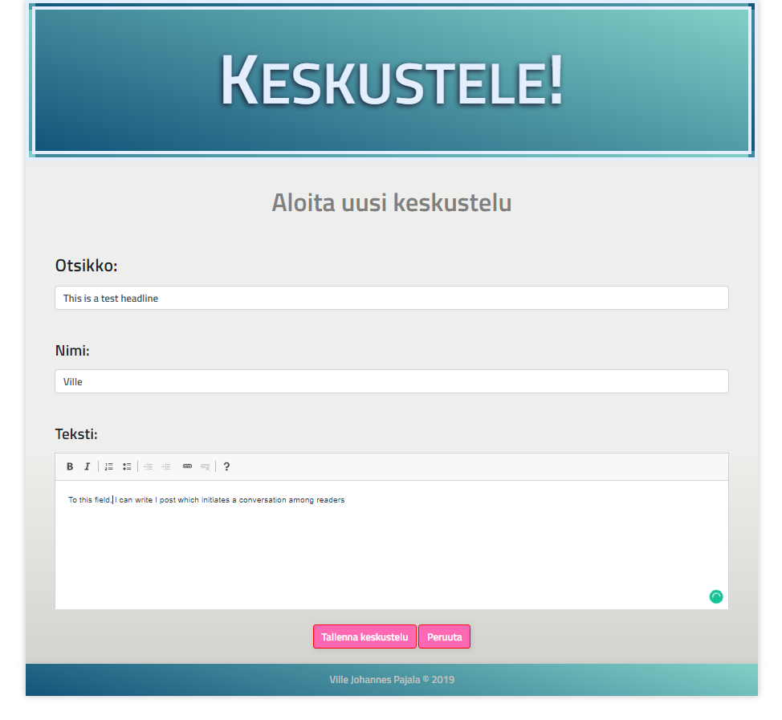
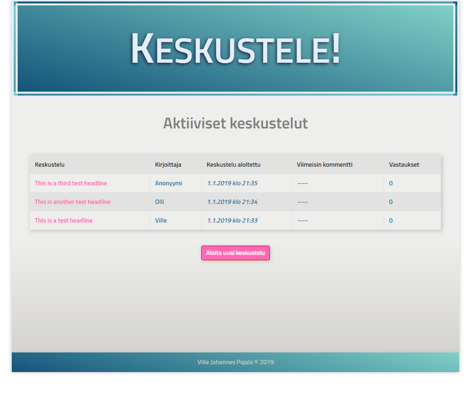
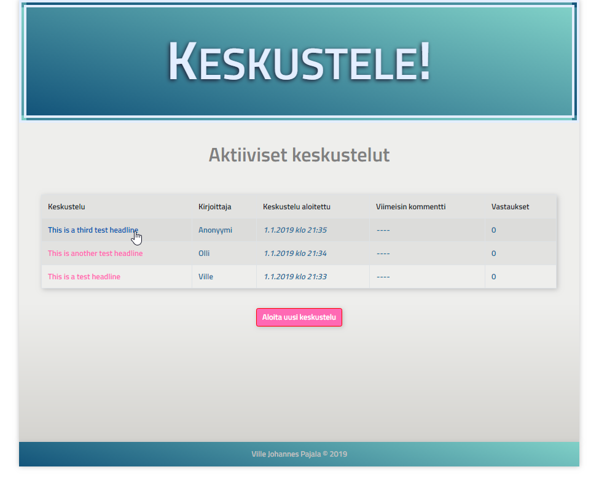
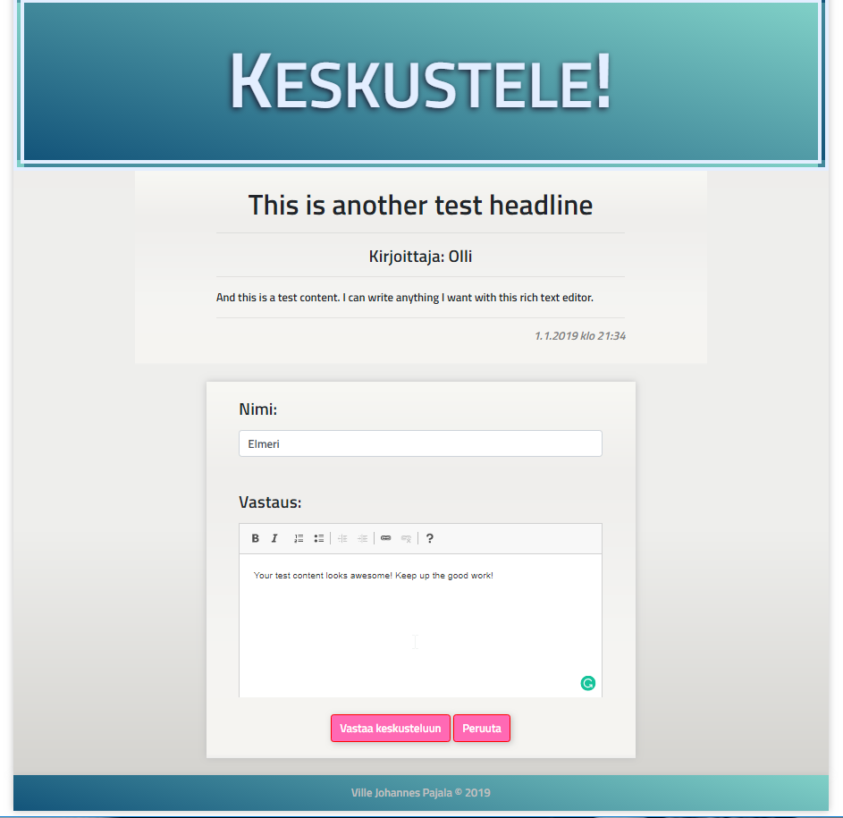
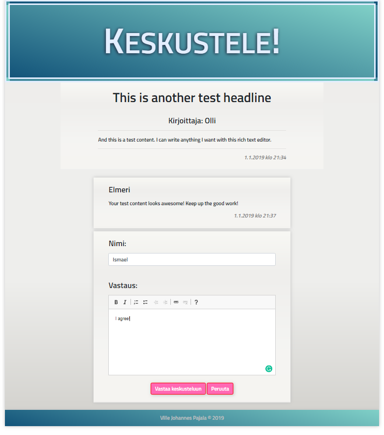

# Discussion Board Made with Node.js
A small Node.js program to run and manage a discussion board

### Current features:

* You can write a text to start a conversation
* You can reply to posts and comments
* You can enter a name or not. If no name is entered, the posts and replies are submitted as "anonymous"
* Topics are saved to a SQL database
* discussions are saved to a SQL database
* The front page shows headlines of discussions, who started the discussion and when, when the last reply was posted and how many replies the topic has in total
* Discussion are ordered so that a topic which has the newest reply, is shown first.
* Topics that have no replies are ordered by timestamp in ascending order.

### Tech Used

* Node.js
* Express.js
* EJS
* JavaScript
* MySql
* HTML
* CSS
* Bootstrap 4

### Screenshots:

