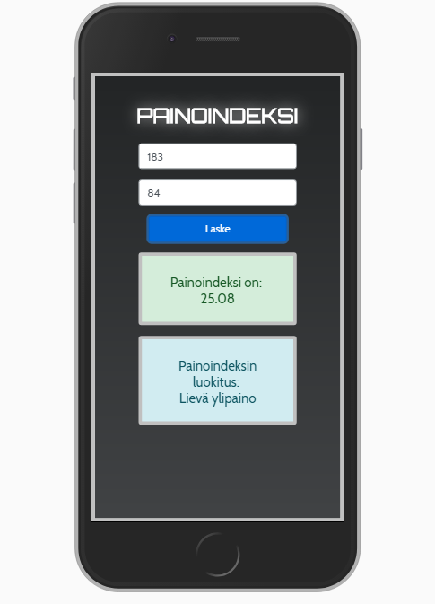

# Body Mass index calculator

Mobile (pwa) version of the bmi calclulator made with Ionic 4.

## Features

* User gives his/her height and weight
* The application returns BMI as numeric value
* The application returns BMI as text value based on weight classifications
* Unit tests written for functionality

## Tech used

* Ionic 4
* TypeScript
* JavaScript ES6
* HTML
* Bootstrap
* CSS
* Heroku

## Screenshots

