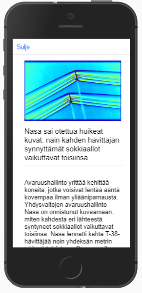

# ionic news api

A mobile (hybrid) news feed (api) made with Ionic framework

### Features

* The front page shows a news feed (custom api made by the teacher)
* The news are sorted by pubslishing time
* News fee shows a thumbnail, header and how long has passed since publishing
* If a news item doesn't have an image, a dummy picture is displayed
* User can click any news item to open it in a popover to see more details
* User can refresh the feed with a button
* User can change news category from a popover menu
* The app always remembers previous settings on refresh
* If ther is new news items after refresh, they are marked with a badge

### Tech Used

* Ionic 4
* TypeScript
* JavaScript ES6
* HTML
* CSS

### Screenshots

