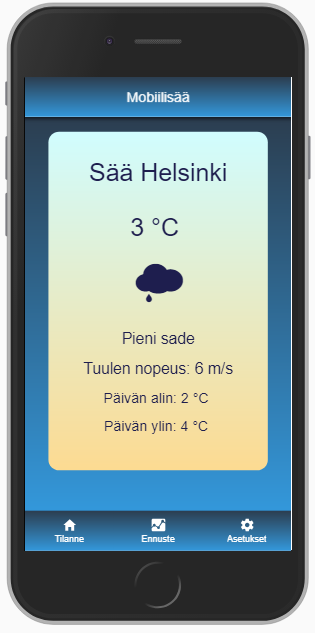
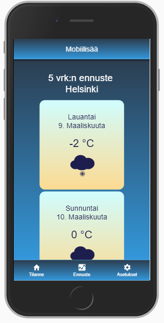
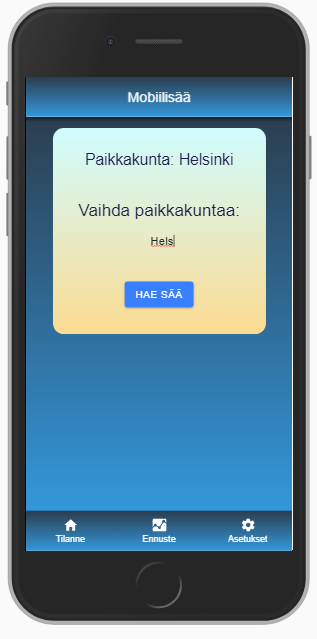

# Weather App with Ionic

A Mobile (hybrid) weather app made with Ionic.

### Features

* User can set a city for the Open Weather Map -api
* The app shows current weather and details on a dedicated tab
* A 5-day weather forecast is show on a dedicated tab
* The app notifies if a city cannot be found
* The app remembers last succesful data search

### Texh Used

* Ionic 4
* TypeScript
* JavaScript ES6
* HTML
* CSS

### Screenshots

