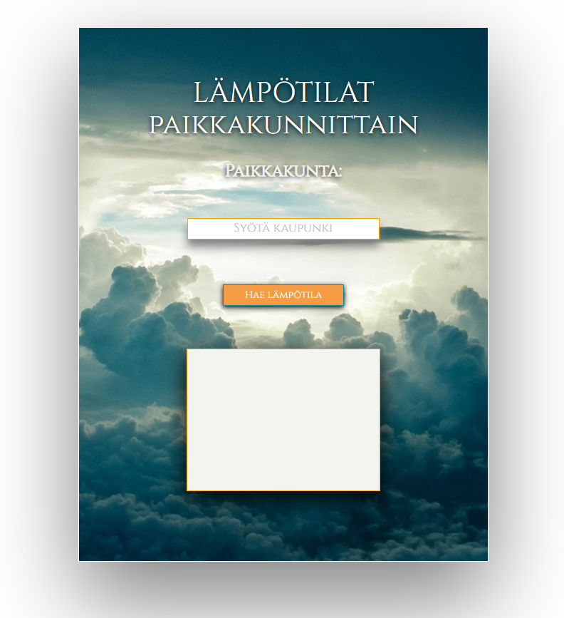
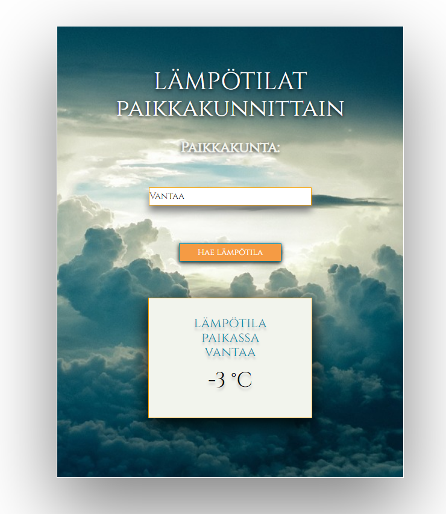

# Weather-app
A small web app to check the temperature of a city. The app uses https://openweathermap.org/api to get the weather data. The Api is handled wtih php.

# Features:

* User can get the current temperature of a city

### Tech Used

* PHP
* jQuery
* HTML
* CSS
* Bootstrap

### Screenshots

