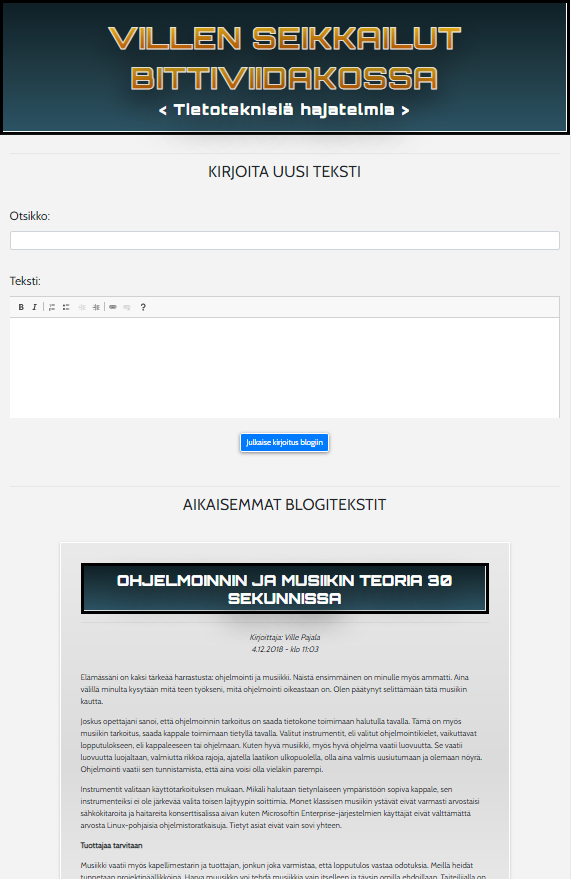
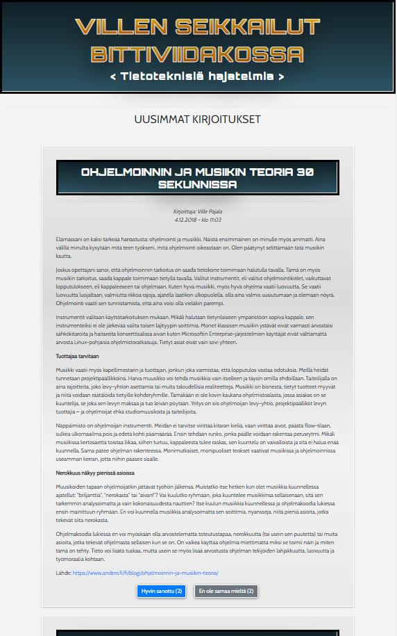

# Blog Writer Node.js
A simple web app for writing blog posts. 

### Current features:

* User can read and like or dislike blog posts
* User can write a post with rich text editor
* User can delete a blog post
* Blog reading and blog writing accessed from different urls

### Possible future features:

* Blog writing and deleting only for a registered users
* Post author automaticallu saved to data based on the user logged in
* Ability to edit posts
* Richer text editor with the possibility to add images

## Tech Used

* Node.js
* Express.js
* EJS
* JavaScript ES6
* HTML
* CSS 
* Bootstrap 4

### Video demo:

### Screenshots:

