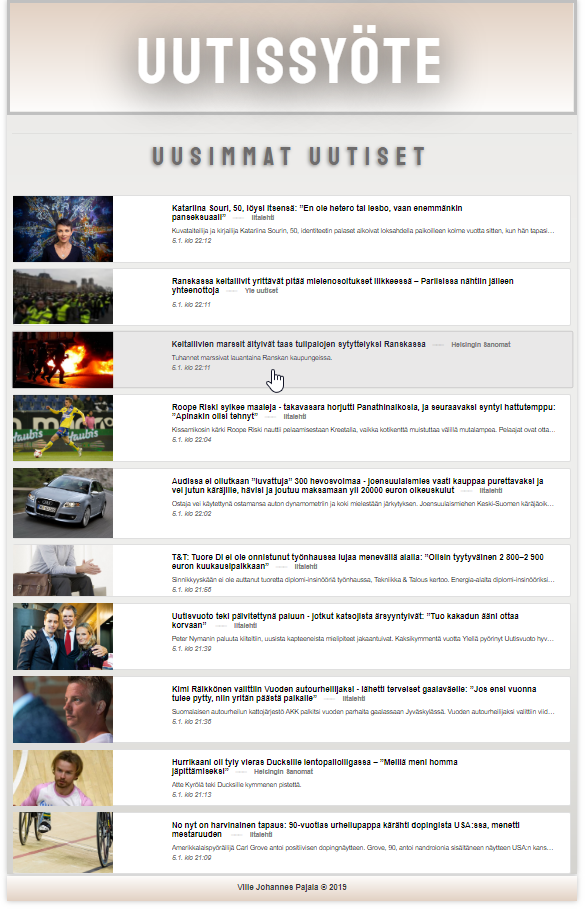
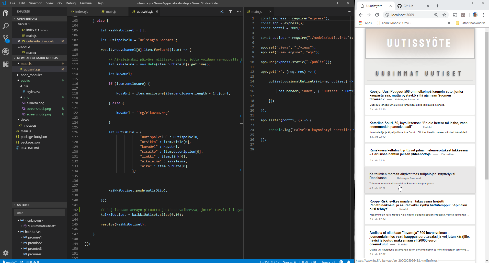

# News Aggregator Node.js
A Node.js app to show content of various news feeds (RSS)

### Current features:

* The app shows news items
* News are compiled from three separate rss-feed sources (Yle, Helsingin sanomat, Iltalehti)
* News are in order - the most recent shown first
* 10 news are shown at a time
* News are updated when the feed is updated
* fully responsive web desing
* The data arrays are processed and limited to maximize speed

### Tech Used

* Node.js
* Express.js
* EJS
* Javascript
* HTML
* CSS
* Bootstrap 4

### Screenshots:

