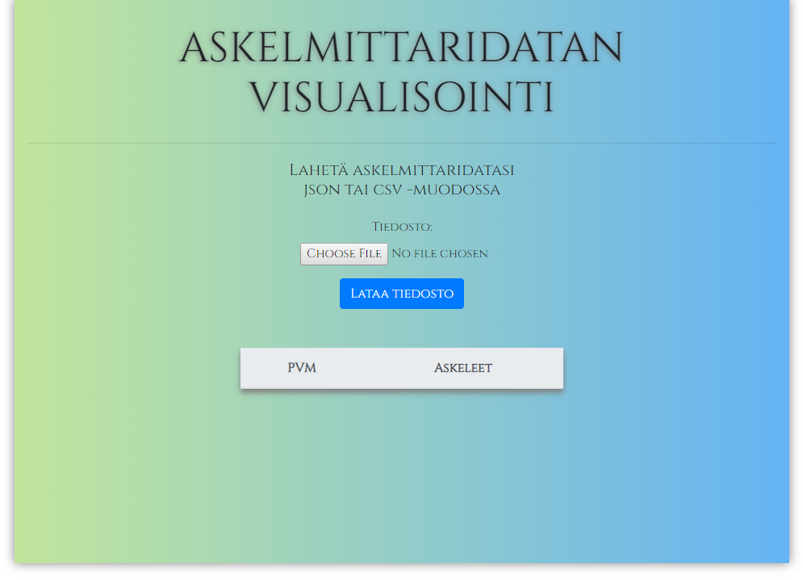
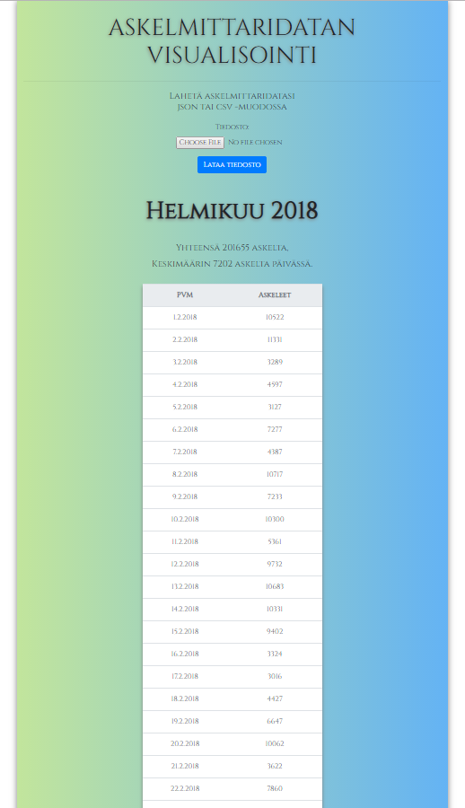

# Pedometer data visualizer 

A node.js application parses .josin ro .csv files in visual form

# Features

* User can uploads a .csv or .json file that contains pedometer data.
* The App handles the file and shows the data as a html table
* The app calculates mean average of steps per day
* public -folder contains test files to test the app. Test files are in .csv and in .json format.
* Ther is also intentionally corrupted files to test error handling

## Tech Used

* Node.js
* Javascript ES6
* HTML
* CSS
* Bootstrap 4

As this was one of the early Node.js exercises, the rendering of html pages is not made view engine. Thus the code looks a bit silly at time, but gets the job done.

The app runs on port 3103: http://localhost:3103/upload

