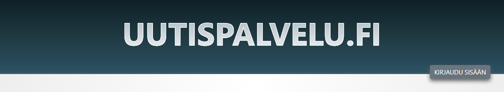
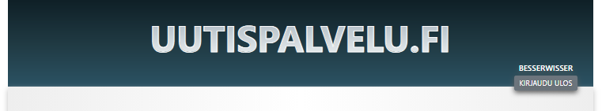
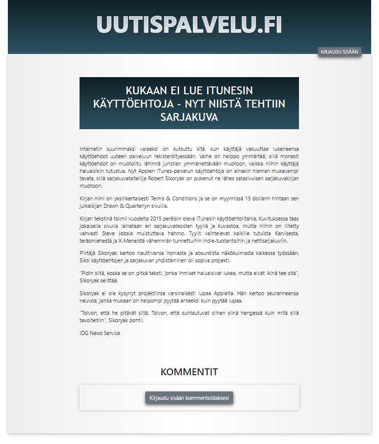
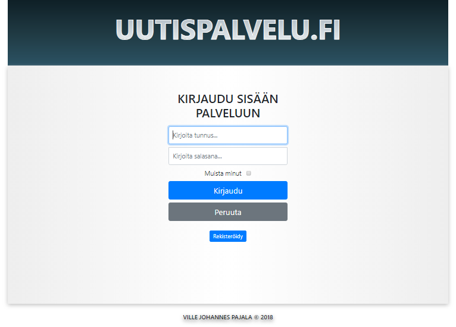
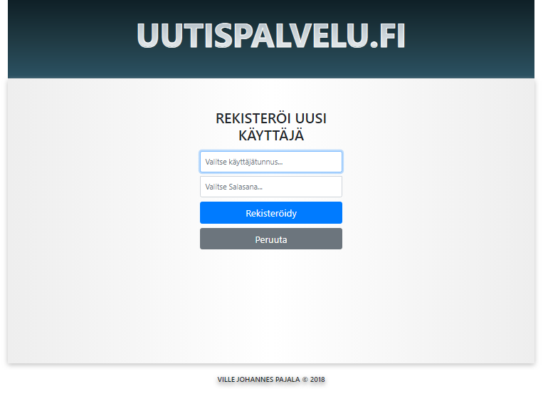
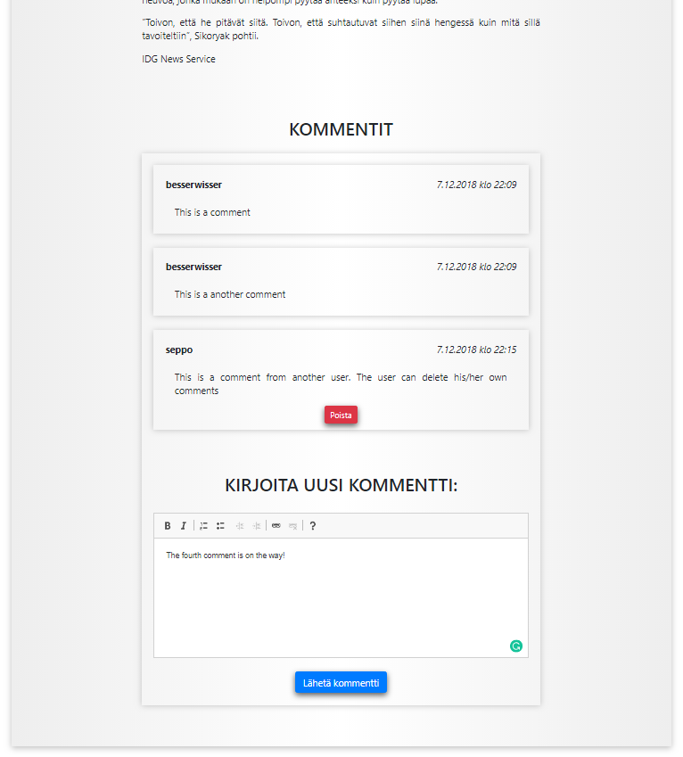

# User Access Manager (Node.js)
A web app that manages user access rights. The system is demoed on a news site sketch. 

### Current features:

* User can register an username and a password
* After registration the user can log in to the site
* If user chooses, he/she can stay logged (session is remembered for 7 days)
* Username and password are saved to database for future use
* Passwords are automatically crypted (SHA512)
* Password verification is done by comparing SHA512 -hashes (only the registrar can know the actual password)
* After login, the user can use a rich text editor to comment on specific news
* Comments posted under the article
* Data of the comments are saved (the comment, commenter's username, timestamp, id of the commented article and an ID) to server
* User may delete his/her comments
* The news site can be still read without login (commenting requires login)
* All database queries are protected from SQL injections

### Future features:

* On registration, empty field are rejected
* The same username cannot be registered more than once
* The registered password must be at least 8 characters with letters and numbers
* News search

### Screenshots:

