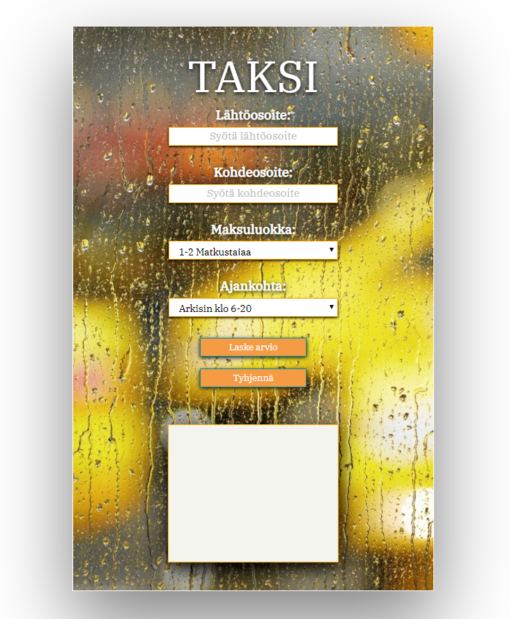
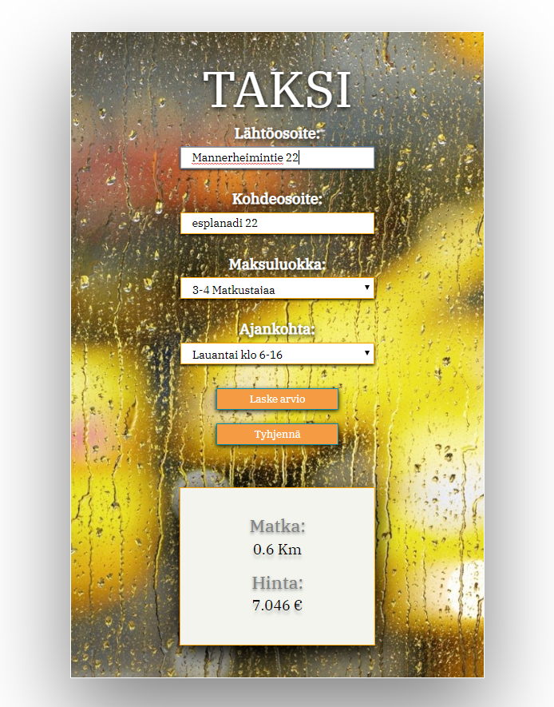

# Taxi fare calculator
A web app to check the cost of a taxi trip

## Features

* User defines starting location
* User defines destination
* User defines how many people will take the taxi drive
* User defines the time of the day and day of the week
* The program counts the distance of the taxi trip
* THe program counts the cost of the trip based on Finland's taxi fare prices (depricated data)

## Tech used

* JavaScript
* PHP
* HTML
* CSS

### Screenshots

