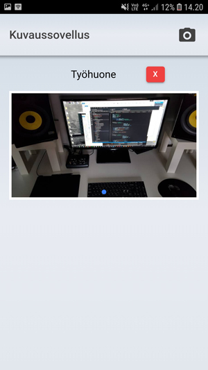

# Real Estate Brokers Photo aApp

A small Ionic Native mobile (hybrid) application to take and name mobile camera

## Features

* User can take a picture inside the app OR choose one from device's photo library
* User can name the picture
* The app shows the picture and it's name
* User can delete an image
* App wants user to confirm delete

## Tech Used

* Ionic 4
* TypeScript
* CSS

## Screenshots

